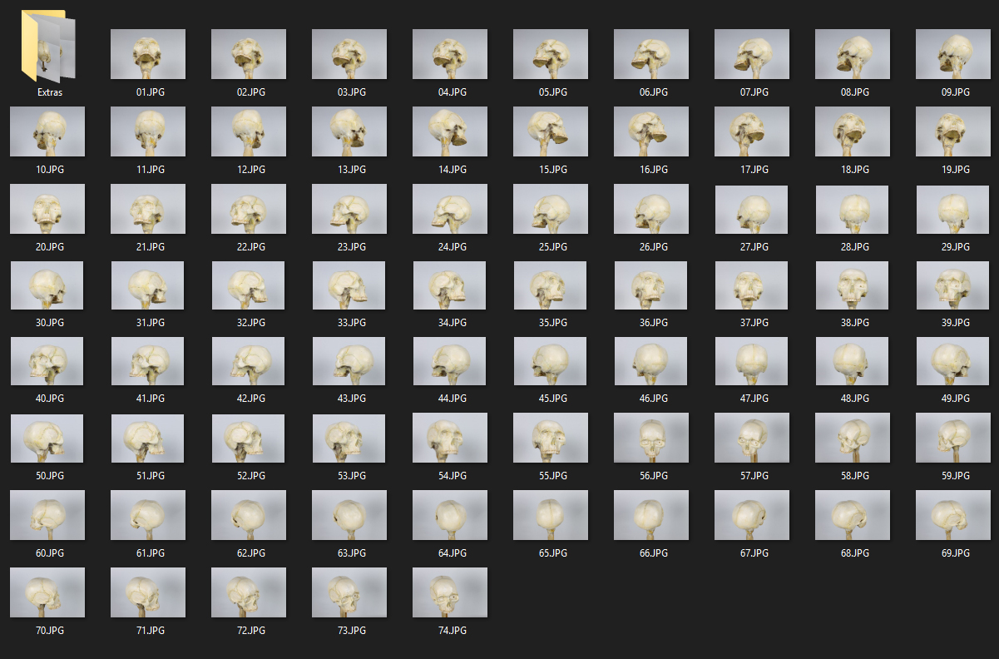

# AR Photogrammetry System

A full-stack pipeline that transforms real-world object photos into an interactive, AR-ready 3D model viewable on any mobile device via QR code.

<table>
  <tr>
    <td width="30%" valign="center">
      
    </td>
    <td width="3%" valign="center" style="text-align:center; font-size:40px; color:#00D4FF; font-weight:bold;">
      ➡
    </td>
    <td width="30%" valign="center">
      
    </td>
    <td width="3%" valign="center" style="text-align:center; font-size:40px; color:#00D4FF; font-weight:bold;">
      ➡
    </td>
    <td width="34%" valign="center">
      
    </td>
  </tr>
</table>

---

## Overview

This system takes a set of photos of a physical object, runs 3D reconstruction using COLMAP, generates a colored mesh, and serves it through a FastAPI web server. Users can view the model in-browser with 360° rotation or place it in augmented reality using their phone's camera.

---

## Pipeline

```text
Raw Images → Filter → COLMAP SfM → Sparse Point Cloud → Delaunay Mesh → Colorize → GLB → Web Viewer → AR
```

1. **Image Filtering** — Removes blurry and duplicate images using Laplacian variance and perceptual hashing
2. **Feature Extraction** — SIFT features extracted from each image (CPU mode, no CUDA required)
3. **Exhaustive Matching** — All image pairs matched for maximum overlap detection
4. **Sparse Reconstruction** — Incremental Structure-from-Motion via COLMAP mapper
5. **Mesh Generation** — Delaunay mesher builds a surface from the sparse point cloud
6. **Mesh Repair & Colorization** — Largest component kept, normals fixed, colors transferred from point cloud via KDTree nearest-neighbor averaging
7. **GLB Export** — Final mesh exported to `.glb` format for web compatibility
8. **Web Viewer** — FastAPI server serves the model via Google's `model-viewer` web component
9. **QR Code** — Auto-generated QR code for instant mobile access on the same network

---

## Tech Stack

| Component          | Tool                                                        |
| ------------------ | ----------------------------------------------------------- |
| 3D Reconstruction  | [COLMAP](https://colmap.github.io/) (CPU, no CUDA)          |
| Mesh Processing    | [trimesh](https://trimsh.org/), [scipy](https://scipy.org/) |
| Image Filtering    | [OpenCV](https://opencv.org/)                               |
| Web Server         | [FastAPI](https://fastapi.tiangolo.com/) + Uvicorn          |
| 3D Viewer          | [Google model-viewer](https://modelviewer.dev/)             |
| AR Modes           | Scene Viewer (Android), Quick Look (iOS)                    |
| QR Generation      | [qrcode](https://pypi.org/project/qrcode/)                  |

---

## Project Structure

```text
AR-Photogrammetry-System/
├── data/
│   ├── raw_images/          # Input photos
│   └── validated_images/    # Filtered photos passed to COLMAP
├── reconstruction/
│   ├── sparse/              # COLMAP sparse model output
│   ├── sparse_points.ply    # Exported point cloud with color
│   └── sparse_mesh.ply      # Delaunay mesh
├── models/
│   ├── glb/model.glb        # Final AR-ready model
│   └── obj/model_mesh.obj   # OBJ export
├── cv_module/
│   └── image_filter.py      # Blur + duplicate filter
├── pipeline/
│   ├── server.py            # FastAPI web server
│   ├── repair_mesh.py       # Mesh cleanup + colorization
│   └── alpha_mesh.py        # Edge-length based hole filtering
├── ar_web_viewer/
│   └── index.html           # model-viewer AR frontend
└── qr_module/
    ├── generate_qr.py       # QR code generator
    └── viewer_qr.png        # Generated QR code
```

---

## Requirements

- Python 3.10+
- [COLMAP](https://colmap.github.io/install.html) (no-CUDA build supported)
- Dependencies: see `requirements.txt`

```bash
pip install -r requirements.txt
```

---

## Usage

### 1. Add your photos

Place images of your object in `data/raw_images/`.

### 2. Run the full pipeline

```bash
# Filter images
python cv_module/image_filter.py

# COLMAP reconstruction (set your COLMAP path)
set QT_QPA_PLATFORM=offscreen
COLMAP feature_extractor --database_path reconstruction/database.db --image_path data/validated_images --FeatureExtraction.use_gpu 0
COLMAP exhaustive_matcher --database_path reconstruction/database.db --FeatureMatching.use_gpu 0
COLMAP mapper --database_path reconstruction/database.db --image_path data/validated_images --output_path reconstruction/sparse
COLMAP model_converter --input_path reconstruction/sparse/0 --output_path reconstruction/sparse_points.ply --output_type PLY
COLMAP delaunay_mesher --input_path reconstruction/sparse/0 --output_path reconstruction/sparse_mesh.ply --input_type sparse

# Process and colorize mesh
python pipeline/repair_mesh.py
```

### 3. Start the server

```bash
python -m uvicorn pipeline.server:app --host 0.0.0.0 --port 8000
```

### 4. Generate QR code

Edit `qr_module/generate_qr.py` to set your machine's local IP, then:

```bash
python qr_module/generate_qr.py
```

Scan `qr_module/viewer_qr.png` on your phone (same WiFi network) to view the model in AR.

---

## AR Viewing

- **Android** — Uses Google Scene Viewer for native AR placement
- **iOS** — Uses Apple Quick Look for AR placement
- **Desktop** — Full 360° rotation and zoom in-browser

---

## Notes

- Dense reconstruction (patch-match stereo) requires CUDA. This pipeline uses CPU-only Delaunay meshing on the sparse model.
- More photos with better overlap around the object produce significantly better results.
- The mesh quality depends on the number of matched feature points in the sparse reconstruction.
